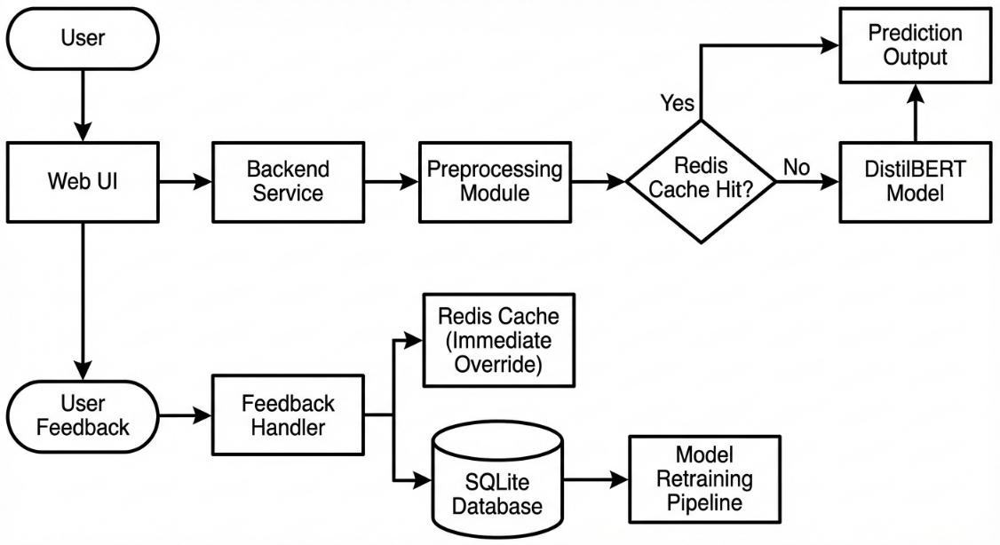

# Hate Speech Detector

Context-aware hate speech detection system with a FastAPI backend, continual learning from moderator feedback, and both Streamlit and Next.js dashboards.

## Project Description

This project is designed to go beyond basic hate-speech classification by combining smart dataset construction with continuous model improvement in production.

1. Teacher-student based labeling for hate vs offensive split:
   A smaller model trained on the Davidson dataset is used as a teacher to refine labels inside broader hate-speech data. This allows the pipeline to split samples into `hate` and `offensive` more consistently, producing cleaner supervision for the main student classifier.

2. Feedback-driven retraining with model versioning:
   The retraining pipeline accepts moderator feedback and mixes it with original training data (replay-style training) to preserve prior knowledge while learning corrections. Each retraining run is saved as a versioned model, and `models/transformer/latest` is updated to the newest version for serving.

## Features

- Transformer-based text classification (`not_hate`, `offensive`, `hate`)
- Rich preprocessing and metadata features for explainability
- Feedback capture API backed by SQLite
- Human override cache and prediction cache via Redis
- Background retraining endpoint to update model from feedback
- Streamlit moderator dashboard (`dashboard/app.py`)
- Next.js frontend (`hate-speech-detector-frontend/`)

## Architecture FLow



## Repository Structure

- `api/`: FastAPI app and routes (`predict`, `feedback`, `dashboard`, `retrain`)
- `hate_speech/`: Model, training, inference, preprocessing
- `db/`: SQLAlchemy models/session
- `continual/`: Replay dataset + weighted trainer for continual learning
- `dashboard/`: Streamlit dashboard app
- `hate-speech-detector-frontend/`: Next.js frontend
- `data/`: Processed and raw datasets
- `models/transformer/`: Versioned model artifacts and `latest`

## Tech Stack

- Backend: FastAPI, SQLAlchemy, Pydantic
- ML: Transformers, PyTorch, Sentence Transformers, scikit-learn
- Data: pandas, datasets
- Storage: SQLite
- Cache/override: Redis
- Frontend: Next.js + React + TypeScript
- Secondary UI: Streamlit

## Prerequisites

- Python 3.10+ (recommended)
- Redis running on `localhost:6379`
- Node.js 20+ (for Next.js frontend)
- A trained model folder at `models/transformer/latest`

## Backend Setup

1. Create and activate a virtual environment.

```powershell
python -m venv venv
& .\venv\Scripts\Activate.ps1
```

2. Install Python dependencies.

```powershell
pip install -r requirements.txt
```

3. Start Redis.

```powershell
redis-server
```

4. Run the FastAPI app.

```powershell
uvicorn api.main:app --reload --host 0.0.0.0 --port 8000
```

5. Open docs.

- Swagger UI: `http://localhost:8000/docs`
- OpenAPI JSON: `http://localhost:8000/openapi.json`

## Frontend Setup (Next.js)

From `hate-speech-detector-frontend/`:

```powershell
pnpm install
pnpm dev
```

Optional environment variable:

- `NEXT_PUBLIC_API_BASE_URL` (default: `http://localhost:8000`)

App runs at `http://localhost:3000` by default.

## Streamlit Dashboard

Run:

```powershell
streamlit run dashboard/app.py
```

The Streamlit dashboard consumes backend endpoints under:

- `GET /api/v1/dashboard/stats`
- `GET /api/v1/dashboard/list`

## API Endpoints

Base prefix: `/api/v1`

### Predict

- `POST /predict/`

Request:

```json
{
  "text": "some user text",
  "include_embedding": false,
  "include_metadata": true
}
```

Response shape:

```json
{
  "label": "offensive",
  "confidence": 0.92,
  "probabilities": {
    "not_hate": 0.05,
    "offensive": 0.92,
    "hate": 0.03
  },
  "preprocessing": {},
  "metadata_features": {}
}
```

### Feedback

- `POST /feedback/`

Request:

```json
{
  "text": "some user text",
  "predicted_label": "offensive",
  "predicted_confidence": 0.92,
  "correct_label": "hate",
  "model_version": "v20260209_000306",
  "moderator_id": "mod_1",
  "notes": "Escalated due to slur",
  "preprocessing": {},
  "metadata_features": {}
}
```

If `correct_label` is provided, an override is written to Redis for future matching text.

### Dashboard

- `GET /dashboard/stats`
- `GET /dashboard/list?limit=200`
- `DELETE /dashboard/delete/{feedback_id}`

### Retraining

- `POST /retrain/`

Triggers background retraining (`retrain_from_feedback.py`) and reloads `models/transformer/latest` after successful completion.

## Model Training and Evaluation

### Initial/standard training

```powershell
python -m hate_speech.train
```

### Retrain from feedback manually

```powershell
python retrain_from_feedback.py --output-version vYYYYMMDD_HHMMSS
```

This saves a versioned model under `models/transformer/<version>` and updates `models/transformer/latest`.

### Compare two saved models

Edit model paths in `evaluate_models.py`, then run:

```powershell
python evaluate_models.py
```

Results are written to `model_comparison.csv`.

## Configuration

- Code defaults: `hate_speech/config.py`
- YAML config file: `config/config.yaml`

Important defaults:

- API prefix: `/api/v1`
- DB URL: `sqlite:///./hate_speech.db`
- Base model: `distilbert-base-uncased`
- Serving model directory: `models/transformer/latest`

## Data Notes

- Processed splits are under `data/processed/` (`train.csv`, `val.csv`, `test.csv`)
- Some scripts expect column names like `text`, others use `content`
- Keep schema consistent when preparing new training/replay datasets

## Common Issues

- `ConnectionError` to Redis: Ensure Redis is running on `localhost:6379`
- `Model not found` during inference: Ensure `models/transformer/latest` exists and contains tokenizer + model files
- Frontend cannot reach backend: Verify backend is running on port `8000` and `NEXT_PUBLIC_API_BASE_URL` is correct


